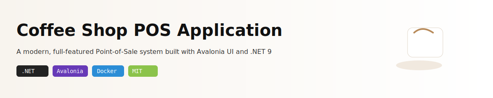

<<<<<<< HEAD
# conffee-management-system



Keimhean Cafe POS — Point-of-sale application for coffee shops built with Avalonia UI and .NET 9

Point-of-sale application for Keimhean Cafe — API, Desktop client, Web front-end.

Contents
- `KeimheanCafePOS.sln` — solution containing API, Desktop, Web, Domain, Infrastructure, Application
- `src/KeimheanCafePOS.API` — ASP.NET Web API
- `src/KeimheanCafePOS.Desktop` — Avalonia desktop client (MVVM)
- `src/KeimheanCafePOS.Web` — optional web UI
- `.github/workflows/ci.yml` — GitHub Actions CI workflow

## Features
- User authentication (seeded `staff` and `admin` users)
- Products and transactions endpoints
- Desktop POS UI (Avalonia)

## Prerequisites
- .NET 9 SDK
- Docker & Docker Compose (for MySQL local DB)

# conffee-management-system

Keimhean Cafe POS — Point-of-sale application (API, Desktop client, Web front-end)

Contents

- `KeimheanCafePOS.sln` — solution containing API, Desktop, Web, Domain, Infrastructure, Application
- `src/KeimheanCafePOS.API` — ASP.NET Web API
- `src/KeimheanCafePOS.Desktop` — Avalonia desktop client (MVVM)
- `src/KeimheanCafePOS.Web` — optional web UI
- `.github/workflows/ci.yml` — GitHub Actions CI workflow

## Features

- User authentication (seeded `staff` and `admin` users)
- Products and transactions endpoints
- Desktop POS UI (Avalonia)

## Prerequisites

- .NET 9 SDK
- Docker & Docker Compose (for MySQL local DB)

## Local development (quick start)

1. Start MySQL and phpMyAdmin (from repo root):

```sh
docker compose -f KeimheanCafePOS/docker-compose.yml up -d --build
```

2. Build the solution:

```sh
dotnet restore KeimheanCafePOS.sln
dotnet build KeimheanCafePOS.sln -c Release
```

3. Run the API (default dev port used in this repo is `http://localhost:5138`):

```sh
cd src/KeimheanCafePOS.API
dotnet run
```

4. Run the Desktop app (Avalonia):

```sh
cd src/KeimheanCafePOS.Desktop
dotnet run
```

5. Test login (example using `curl`):

```sh
curl -X POST http://localhost:5138/api/auth/login \
  -H "Content-Type: application/json" \
  -d '{"username":"staff","password":"<sha256-hash-of-password>"}'
```

Notes:

- The repo seeds `staff` and `admin` accounts. The Desktop client currently hashes the password client-side using SHA256 before sending; the API compares that hash to the stored `PasswordHash`.

## Configuration

- Connection strings and environment-specific settings live in `src/KeimheanCafePOS.API/appsettings.json` and `appsettings.Development.json`.
- If you run MySQL via the provided `docker-compose.yml`, the service name and credentials are configured there.

## CI (GitHub Actions)

- A basic CI workflow is provided at `.github/workflows/ci.yml` that:
  - Restores and builds the solution
  - Publishes the API and desktop artifacts
  - Optionally builds & pushes a Docker image when `DOCKERHUB_USERNAME` and `DOCKERHUB_TOKEN` secrets are set and a `Dockerfile` exists at `src/KeimheanCafePOS.API/Dockerfile`.

If you enable Docker publishing, add the Docker Hub secrets in the repository settings.

## Troubleshooting

- If your CI fails because of missing `Dockerfile`, either add one to `src/KeimheanCafePOS.API/` or remove the `docker-push` job from the workflow.
- To keep the repository clean, avoid committing `bin/` and `obj/` folders — `.gitignore` has standard .NET ignores.

## Contributing

- Open issues or PRs on the repository. Follow the existing project structure and run the local build steps before creating PRs.

## License

- Add your license file (e.g., `LICENSE`) and update this section.
